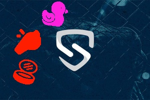
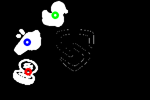

# Geetest-captcha-click-by-order
Geetest-captcha-click-by-order is a simple service for solving the geetest captcha which contains three small images to define on 200x300 image by order.

## Used libraries
* [cv2](https://pypi.org/project/opencv-python/)

## To launch the program
```bash
python3 main.py
```

## Images for testing



## Result looks like


